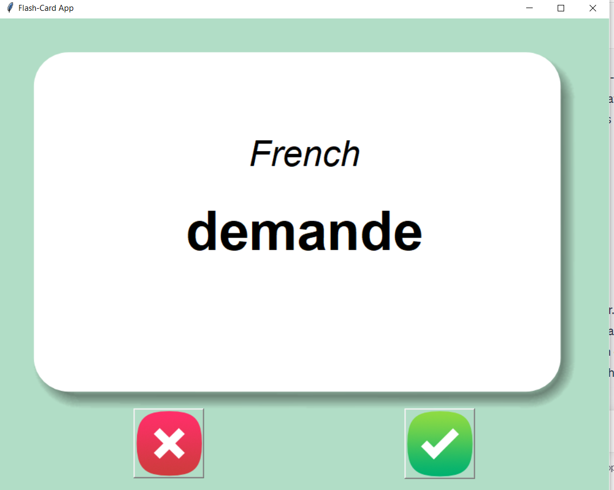
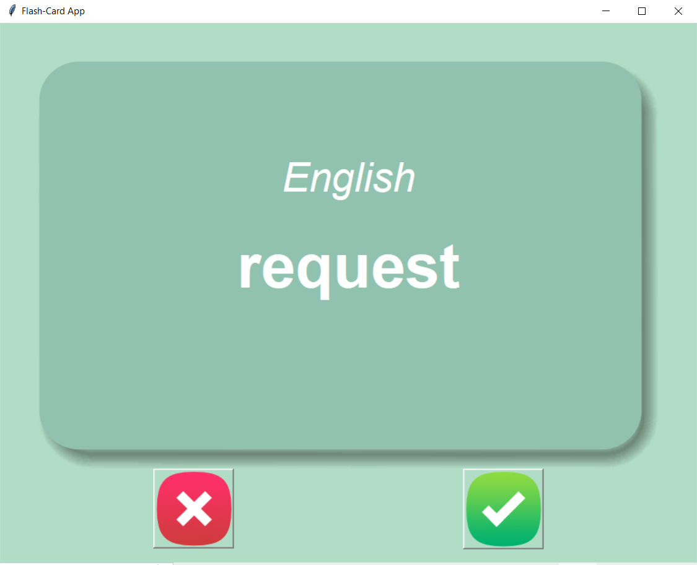

# Flash Card Game
## Description
This is a simple flash-card game built with Python and tkinter. It allows users to learn and practice French-to-English translations. The game presents a French word, and the user has to guess the corresponding English translation. The user can click on "Right" or "Wrong" buttons to indicate whether they know the word or not, and the game will progress accordingly.

### For example:
#### French word

#### Its meaning in English 

## Requirements
Before running the game, you need to install the following Python libraries:
<ul>
    <li>pandas</li>
    <li>tkinter</li>
</ul>

## Installation
<ol type=1>
    <li>
        Clone the repository:
    </li>
    <b>git clone https://github.com/Eshgin1337/SmartFlashCards.git</b>  
    <b>cd flash-card-game</b>
    <li>Install the required libraries using pip:</li>
    You will first need to create virtual environment in the directory where main.py file is located:  
    <b>virtualenv venv</b>  
    Then you need to activate it:  
    <b>source venv/Scripts/activate</b>  
    Once virtual environment is activated, necessary libraries (pandas and tkinter) can be installed:  
    <b>pip install pandas</b>  
    <b>pip install tkinter</b>  
    After comleting all steps it remains to run the game and enjoy learning:  
    <b>python main.py</b>  
</ol>

## Usage
<ol type=1>
    <li>Prepare the word list:</li>
    The game uses a CSV file to store the words to learn. The file is named `words_to_learn.csv` and should be located in the `data` folder. If the file doesn't exist, the game will create it by copying the words from `french_words.csv`.
    <li>Run the game</li>
    <b>python main.py</b>  
    <li>The game window will pop up, showing the French word. After a few seconds, the card will flip to show the English translation.</li>
    <li>If you know the translation, click the "Right" button, and the word will be removed from the learning list. If you don't know the translation, click the "Wrong" button, and the word will be presented again later.</li>
    <li>The game will continue until all words have been learned.</li>
</ol>

## Acknowledgments
This game was inspired by Angela Yu's flash-card game tutorial.

## Contributing
Contributions are welcome! If you have any suggestions, bug fixes, or improvements, please feel free to open an issue or submit a pull request.

